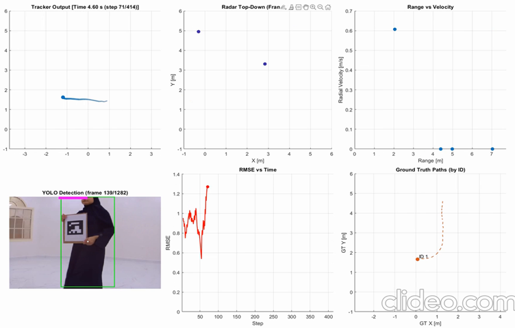

<h3>Senior Design Project</h3>

<h4>Radar–Camera Data Fusion System Using the Extended Kalman Filter</h4>

Designed and implemented a multi-sensor data fusion system for target tracking by combining radar and camera measurements.
An Extended Kalman Filter (EKF) integrates asynchronous radar measurements (position and radial velocity) with camera-based
object detections obtained using YOLO. A Global Nearest Neighbour (GNN) algorithm performs probabilistic
measurement-to-track assignment. Tracking performance is benchmarked using ground-truth states extracted from ArUco markers.
Applications include <strong>Advanced Driver Assistance Systems (ADAS)</strong>.

<strong>Skills Demonstrated:</strong>
<ul>
  <li>Extended Kalman Filter (EKF) derivation and implementation</li>
  <li>Radar–camera intrinsic and extrinsic calibration</li>
  <li>Asynchronous sensor fusion and out-of-sequence measurement handling</li>
  <li>MATLAB-based tracking pipelines</li>
  <li>System-level integration and technical leadership</li>
</ul>

   
  <em>High-level block diagram of the radar–camera fusion pipeline</em>

<strong>My Contribution:</strong>
<ul>
  <li>
    Designed and implemented the EKF-based fusion and tracking pipeline from scratch, performed calibration,
    interfaced the TI IWR6843 radar with the Raspberry Pi, integrated team-developed modules, and led system-level
    testing and performance evaluation.
  </li>
</ul>

<strong>Demo Video</strong>

   
  <em>Demonstration of asynchronous EKF fusion and target tracking</em>

<strong>Key Highlights:</strong>
<ul>
  <li>Radar-only EKF tracking achieved RMSE values as low as <strong>0.5 m</strong></li>
  <li>Asynchronous fusion architecture supports out-of-sequence measurements</li>
  <li>
    Camera-based fog classification module implemented but not evaluated due to reprojection errors
    in the experimental setup
  </li>
  <li>MATLAB codebase is modular and fully documented for reproducibility</li>
</ul>
